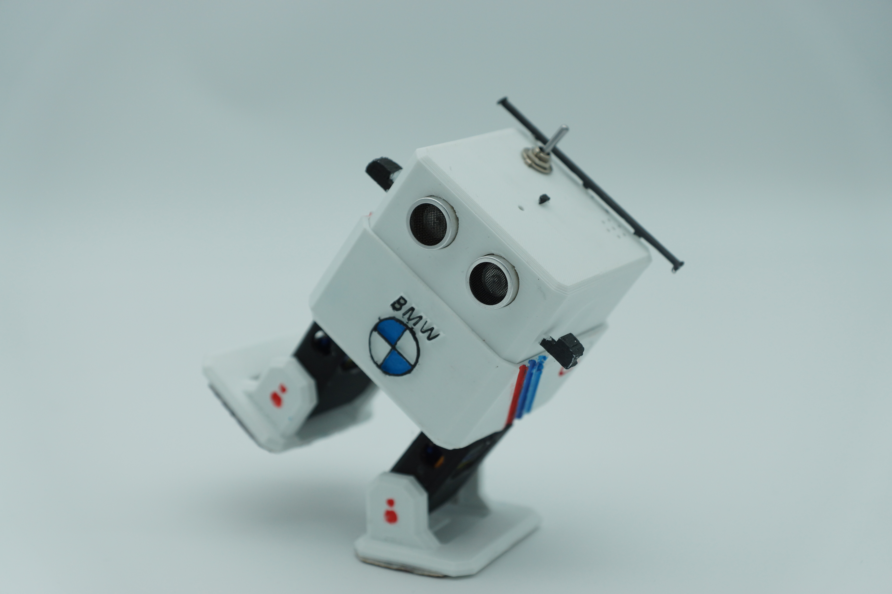

# Conception et prototypage

Pour nous démarquer lors des épreuves et des Ottolympiades, notre équipe a choisi de donner à notre robot un design inspiré de l'univers automobile, et plus particulièrement de la marque BMW. L'objectif était de créer un robot au look agressif et "sport", tout en intégrant des éléments aérodynamiques utiles pour la compétition.

Nous avons modélisé deux petits rétroviseurs latéraux profilés. Ils ont été conçus pour s'emboîter directement dans des encoches ajoutées sur les côtés de la tête du robot.

{width=300px}
