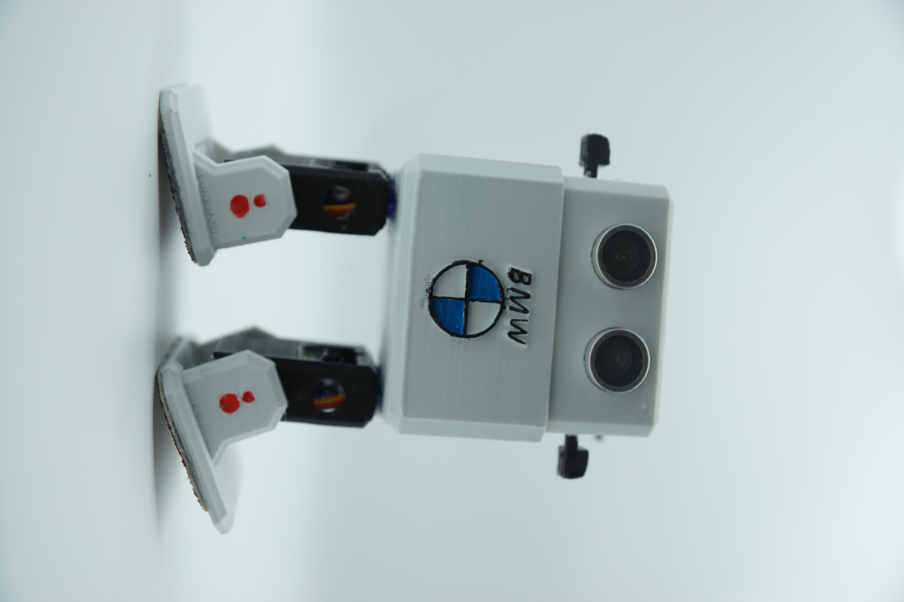
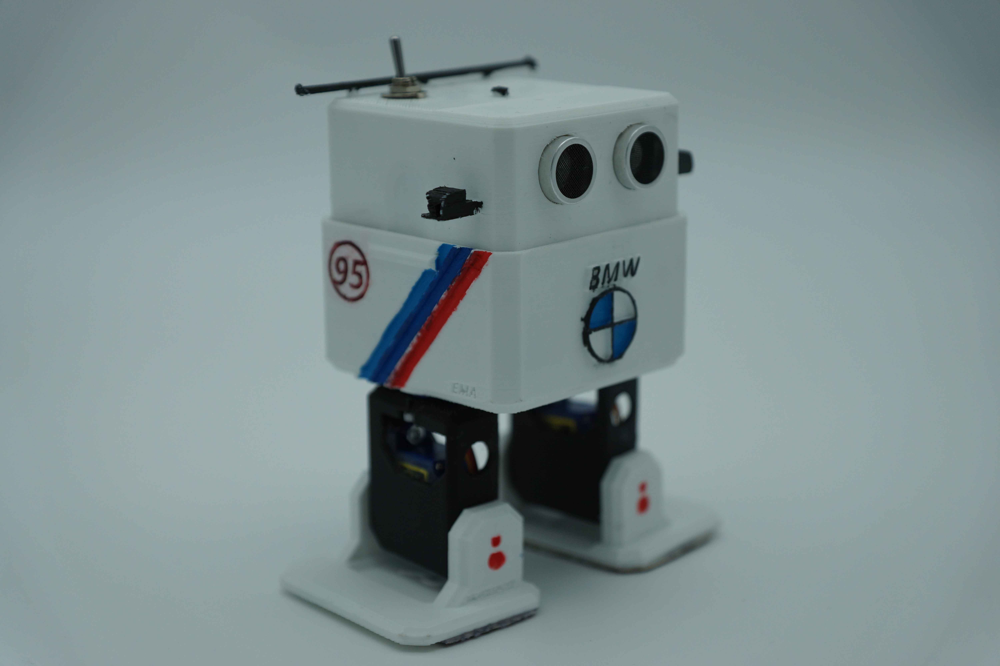
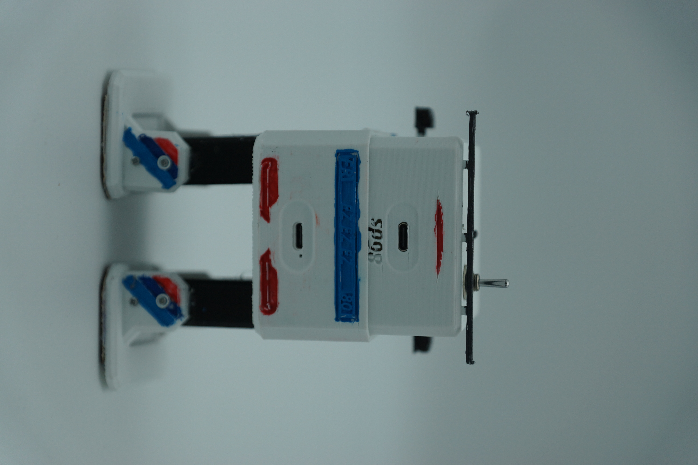

# Conception et prototypage

Pour nous démarquer lors des épreuves et des Ottolympiades, notre équipe a choisi de donner à notre robot un design inspiré de l'univers automobile, et plus particulièrement de la marque BMW. L'objectif était de créer un robot au look agressif et "sport", tout en intégrant des éléments aérodynamiques utiles pour la compétition.

**Personnalisation et Identité BMW**

Comme l'illustre la figure ci-dessus, notre conception finale intègre des éléments clés qui rappellent directement l'identité visuelle de la marque :

* Face avant : Le logo BMW ainsi que l'inscription ont été intégrés en relief directement sur le bouclier avant de la carrosserie, centré sous le capteur à ultrasons.

* Rétroviseurs et Bandes Sport : Deux rétroviseurs latéraux noirs ont été fixés sur la tête. De plus, les trois célèbres bandes de couleur de la division sportive (Bleu clair, Bleu foncé, Rouge) ont été peintes/intégrées sur le flanc droit du châssis.

* L'Aileron arrière et Interrupteur : Un aileron fin de type "lame" noire a été conçu et fixé à l'arrière supérieur de la tête. Juste devant, un interrupteur à levier métallique robuste a été implanté sur le sommet de la coque pour permettre une mise sous tension rapide du système avant le départ des courses.

**Prototypage et Fabrication**

   

**Analyse du prototype réel et finitions**

La phase d'assemblage et de finition de notre modèle OTTO-BMW a nécessité plusieurs choix de fabrication précis au MakerSpace :

* Gestion des couleurs à l'impression : Pour obtenir ce rendu bicolore, la carrosserie principale et les pieds ont été imprimés en PLA blanc, offrant un contraste parfait avec les éléments mécaniques internes (servomoteurs noirs) et les accessoires (aileron, jambes, rétroviseurs imprimés en noir).

* Ajustement des détails visuels : Les détails du logo et des jantes de fixation des chevilles (marquées de points rouges) ont été finalisés à la main pour accentuer le look "compétition" du robot.

* Validation de la garde au sol : La photo montre le robot en pleine phase de test de balancement (marche sur un pied). On constate que le profil bas du bouclier avant ne gêne pas l'amplitude du mouvement et assure une excellente stabilité dynamique. Les patins d'adhérence ajoutés sous les semelles sont également visibles et valident nos choix techniques pour l'épreuve de traction.
